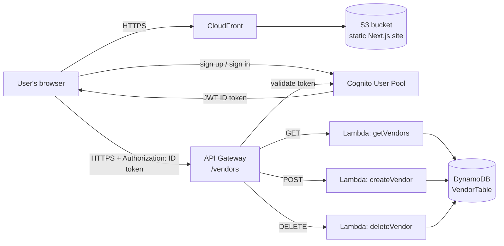

# Vendor Tracker

A small full-stack, serverless web app for keeping a list of vendors (name, category, contact email). Users sign up and sign in with email, then add, view and delete vendors. Each user has their own private vendor list. Everything runs on AWS and is defined as code with the AWS CDK, so a single command creates the whole stack in your own account.

- **Frontend:** Next.js (static export) + React + Tailwind CSS + AWS Amplify UI for login
- **Backend:** API Gateway (REST) → AWS Lambda (Node.js / TypeScript) → DynamoDB
- **Auth:** Amazon Cognito User Pool (email sign-up with a verification code)
- **Hosting:** S3 (private bucket) behind CloudFront (HTTPS + CDN)
- **Infrastructure as code:** AWS CDK v2 (TypeScript)

---

## Table of contents

1. [Architecture](#architecture)
2. [How it works](#how-it-works)
3. [Project structure](#project-structure)
4. [API reference](#api-reference)
5. [Prerequisites](#prerequisites)
6. [Deploying to your own AWS account](#deploying-to-your-own-aws-account)
7. [Local development](#local-development)
8. [Updating the app](#updating-the-app)
9. [Tearing it down](#tearing-it-down)
10. [Cost](#cost)
11. [Troubleshooting](#troubleshooting)
12. [Known limitations and ideas for improvement](#known-limitations-and-ideas-for-improvement)

---

## Architecture



All of these resources are created by one CDK stack, `BackendStack`, defined in [backend/lib/backend-stack.ts](backend/lib/backend-stack.ts).

| # | Resource | What it does |
|---|----------|--------------|
| 1 | **DynamoDB table** `VendorTable` | Stores vendors. Partition key `vendorId` (string). A global secondary index, `ownerId-index`, keyed on `ownerId` lets each user's vendors be fetched efficiently. On-demand (pay-per-request) billing. |
| 2 | **3 Lambda functions** | `CreateVendorHandler`, `GetVendorsHandler`, `DeleteVendorHandler`. CDK bundles the TypeScript with esbuild (`NodejsFunction`). The table name is passed in through the `TABLE_NAME` environment variable. |
| 3 | **IAM permissions** | Least privilege: the read Lambda can only read the table, and the create and delete Lambdas can only write to it. |
| 4 | **Cognito User Pool** + app client + hosted domain | Self sign-up with email as the username. Users verify their email with a code. |
| 5 | **API Gateway REST API** `Vendor Service` | One resource, `/vendors`, with `GET`, `POST` and `DELETE` methods. Each method is protected by a Cognito User Pool authorizer. CORS is enabled for all origins. |
| 6 | **S3 bucket** | Holds the built frontend. Public access is fully blocked, so files are only served through CloudFront. |
| 7 | **CloudFront distribution** | Serves the site over HTTPS (HTTP redirects to HTTPS). 404s are rewritten to `/index.html` so client-side routing works. |
| 8 | **BucketDeployment** | Uploads `frontend/out/` to the bucket on every deploy and invalidates the CloudFront cache (`/*`). |
| 9 | **Stack outputs** | `ApiEndpoint`, `UserPoolId`, `UserPoolClientId`, `CloudFrontURL`. These connect the frontend to the backend. |

---

## How it works

### 1. Authentication

[frontend/app/providers.tsx](frontend/app/providers.tsx) configures Amplify with the Cognito User Pool ID and app client ID, which are read from `NEXT_PUBLIC_*` environment variables when the site is built.

[frontend/app/page.tsx](frontend/app/page.tsx) wraps the main page in Amplify's `withAuthenticator`. A visitor who isn't signed in sees Amplify's built-in **Sign In / Create Account** screen. New users enter an email and password, receive a verification code by email, and confirm their account. Once signed in, the page receives `user` (used to show "Signed in as …") and `signOut`.

### 2. Calling the API

[frontend/lib/api.ts](frontend/lib/api.ts) wraps every API call:

1. `fetchAuthSession()` gets the current user's Cognito **ID token** (a JWT).
2. The token is sent in the `Authorization` header to `${NEXT_PUBLIC_API_URL}/vendors`.
3. API Gateway's Cognito authorizer checks the token's signature and expiry against the User Pool **before** any Lambda runs. A missing or invalid token gets a `401 Unauthorized` back, and no Lambda is invoked.
4. For valid tokens, API Gateway passes the token's claims to the Lambda in `event.requestContext.authorizer.claims`. The handlers use `claims.sub` (the user's unique Cognito ID) as the **owner** of each vendor.

### 3. Lambda handlers

| Handler | File | DynamoDB call | Notes |
|---------|------|---------------|-------|
| List vendors | [backend/lambda/getVendors.ts](backend/lambda/getVendors.ts) | `Query` on `ownerId-index` | Returns only the caller's vendors, as a JSON array. |
| Create vendor | [backend/lambda/createVendor.ts](backend/lambda/createVendor.ts) | `Put` | Generates `vendorId` with `crypto.randomUUID()`, sets `ownerId` to the caller's `sub`, and stamps `createdAt` (ISO 8601). |
| Delete vendor | [backend/lambda/deleteVendor.ts](backend/lambda/deleteVendor.ts) | `Delete` with a condition | Reads `vendorId` from the JSON request body. Only deletes if `ownerId` matches the caller. Returns `400` if `vendorId` is missing, or `404` if it doesn't exist or belongs to someone else. |

Because the owner comes from the verified token, not from the request body, users can't read or delete each other's vendors.

Each handler returns CORS headers (`Access-Control-Allow-Origin: *`) so the browser accepts the response, and returns `500` with a JSON `error` message if DynamoDB throws. The error is logged to CloudWatch Logs.

### 4. Data model

```ts
// frontend/types/vendor.ts
// (items in DynamoDB also have an `ownerId`: the Cognito `sub` of the user who created it)
interface Vendor {
  vendorId?: string;    // UUID, generated server-side
  name: string;
  category: string;     // free text, e.g. "SaaS", "Hardware"
  contactEmail: string;
  createdAt?: string;   // ISO timestamp, generated server-side
}
```

### 5. Frontend hosting

[frontend/next.config.ts](frontend/next.config.ts) sets `output: "export"`, so `npm run build` produces plain static HTML/JS/CSS in `frontend/out/` and needs no Node.js server. The CDK stack uploads that folder to S3 and serves it through CloudFront.

> **Important:** `NEXT_PUBLIC_*` variables are **baked into the JavaScript at build time**. Changing them means rebuilding the frontend and redeploying.

---

## Project structure

```
vendor-tracker/
├── backend/                     # AWS CDK app (infrastructure + Lambda code)
│   ├── bin/backend.ts           # CDK entry point: creates BackendStack
│   ├── lib/backend-stack.ts     # All AWS resources are defined here
│   ├── lambda/
│   │   ├── createVendor.ts      # POST   /vendors
│   │   ├── getVendors.ts        # GET    /vendors
│   │   └── deleteVendor.ts      # DELETE /vendors
│   ├── test/backend.test.ts     # Jest placeholder (no real tests yet)
│   ├── cdk.json                 # Tells the CDK CLI how to run the app + feature flags
│   ├── package.json
│   └── tsconfig.json
│
└── frontend/                    # Next.js static site
    ├── app/
    │   ├── layout.tsx           # Root layout, wraps everything in <Providers>
    │   ├── providers.tsx        # Amplify.configure(...) with Cognito settings
    │   ├── page.tsx             # The whole UI: form + vendor list, behind withAuthenticator
    │   └── globals.css          # Tailwind import
    ├── lib/api.ts               # fetch wrappers that attach the Cognito JWT
    ├── types/vendor.ts          # Vendor TypeScript type
    ├── next.config.ts           # output: "export" → static site in out/
    ├── .env.local               # (you create this; git-ignored) API URL + Cognito IDs
    └── package.json
```

---

## API reference

Base URL: the `ApiEndpoint` stack output, for example `https://abc123.execute-api.us-east-1.amazonaws.com/prod/`.

Every request needs the header `Authorization: <Cognito ID token>`.

### `GET /vendors`

Returns the signed-in user's vendors.

```json
[
  {
    "vendorId": "3f0c1b2e-…",
    "ownerId": "a1b2c3d4-…",
    "name": "Acme Corp",
    "category": "Hardware",
    "contactEmail": "sales@acme.example",
    "createdAt": "2026-10-05T14:03:22.123Z"
  }
]
```

### `POST /vendors`

```json
{ "name": "Acme Corp", "category": "Hardware", "contactEmail": "sales@acme.example" }
```

→ `201 { "message": "Vendor created", "vendorId": "…" }`

### `DELETE /vendors`

The ID goes in the **request body**, not the URL:

```json
{ "vendorId": "3f0c1b2e-…" }
```

→ `200 { "message": "Vendor deleted" }`, `400` if `vendorId` is missing, or `404` if the vendor doesn't exist or isn't yours.

### Calling the API with curl

You can get an ID token with the AWS CLI. This requires enabling the `USER_PASSWORD_AUTH` flow on the app client, or you can copy the token from the browser's dev tools after signing in:

```bash
TOKEN="eyJraWQiOi..."   # Cognito ID token
API="https://abc123.execute-api.us-east-1.amazonaws.com/prod"

curl -H "Authorization: $TOKEN" "$API/vendors"
```

---

## Prerequisites

| Tool | Version | Check |
|------|---------|-------|
| [Node.js](https://nodejs.org/) | 22 LTS or newer recommended | `node -v` |
| npm | 10+ (comes with Node) | `npm -v` |
| [AWS CLI v2](https://docs.aws.amazon.com/cli/latest/userguide/getting-started-install.html) | latest | `aws --version` |
| An AWS account | with permission to create IAM roles, Lambda, API Gateway, DynamoDB, Cognito, S3 and CloudFront (admin is easiest for a personal account) | |

You don't need to install the CDK CLI globally. It's a dev dependency of `backend/` and runs with `npx cdk`.

Configure credentials for the account and region you want to deploy to:

```bash
aws configure          # or: aws configure sso / aws login
aws sts get-caller-identity   # confirm you're in the right account
```

The stack is **environment-agnostic**, so it deploys to whatever account and region your current AWS CLI profile points at. Use `AWS_PROFILE` or `AWS_REGION` to change the target.

---

## Deploying to your own AWS account

The CDK stack uploads `frontend/out/`, but the frontend build needs values (API URL, Cognito IDs) that only exist **after** the stack is deployed. So the first deployment takes **two passes**:

1. Deploy once to create the backend.
2. Put the outputs in `.env.local`, rebuild the frontend, and deploy again.

### Step 1: Clone and install

```bash
git clone <your-fork-url> vendor-tracker
cd vendor-tracker

cd backend  && npm install && cd ..
cd frontend && npm install && cd ..
```

### Step 2: Bootstrap CDK (once per account and region)

CDK needs a small "bootstrap" stack (an S3 bucket and IAM roles for assets) in each account and region you deploy to:

```bash
cd backend
npx cdk bootstrap
```

### Step 3: First build of the frontend

The stack requires `frontend/out/` to exist, so build it once. The env vars are still empty at this point, which is expected.

```bash
cd ../frontend
npm run build          # creates frontend/out/
```

### Step 4: First deploy

```bash
cd ../backend
npx cdk deploy --outputs-file ./cdk-outputs.json
```

Review the IAM/security changes CDK shows you and answer `y`. The first deploy takes about 5–10 minutes, mostly waiting on CloudFront. When it finishes you'll see outputs like this:

```
Outputs:
BackendStack.ApiEndpoint      = https://abc123.execute-api.us-east-1.amazonaws.com/prod/
BackendStack.UserPoolId       = us-east-1_AbCdEfGhI
BackendStack.UserPoolClientId = 1a2b3c4d5e6f7g8h9i0j
BackendStack.CloudFrontURL    = https://d1234abcd.cloudfront.net
```

These are also saved to `backend/cdk-outputs.json` (git-ignored). You can find them later in the AWS Console under **CloudFormation → BackendStack → Outputs**.

### Step 5: Configure the frontend

Create `frontend/.env.local`. Leave off the trailing slash on the API URL, because the code appends `/vendors`.

```bash
NEXT_PUBLIC_API_URL=https://abc123.execute-api.us-east-1.amazonaws.com/prod
NEXT_PUBLIC_USER_POOL_ID=us-east-1_AbCdEfGhI
NEXT_PUBLIC_USER_POOL_CLIENT_ID=1a2b3c4d5e6f7g8h9i0j
```

`.env*` files are git-ignored, so these values won't be committed.

### Step 6: Rebuild and redeploy

```bash
cd ../frontend
npm run build

cd ../backend
npx cdk deploy
```

This second deploy only re-uploads the site and invalidates the CloudFront cache, so it's much faster.

### Step 7: Use it

Open the `CloudFrontURL`, click **Create Account**, enter your email and a password, type in the verification code from your inbox, and start adding vendors.

> Cognito's default email sender is limited to a small number of emails per day. That's fine for personal use. For real traffic, [configure Cognito to send through Amazon SES](https://docs.aws.amazon.com/cognito/latest/developerguide/user-pool-email.html).

---

## Local development

The frontend can run locally against the **deployed** backend. CORS allows any origin, so `localhost` works.

```bash
cd frontend
# make sure .env.local exists (see Step 5)
npm run dev
# open http://localhost:3000
```

Useful commands:

| Where | Command | What it does |
|-------|---------|--------------|
| `frontend/` | `npm run dev` | Dev server with hot reload |
| `frontend/` | `npm run build` | Static production build → `out/` |
| `frontend/` | `npm run lint` | ESLint |
| `backend/` | `npm run build` | Type-check the CDK app (`tsc`, no emit) |
| `backend/` | `npx cdk synth` | Print the generated CloudFormation template |
| `backend/` | `npx cdk diff` | Show what would change in AWS |
| `backend/` | `npx cdk deploy` | Deploy / update the stack |
| `backend/` | `npm test` | Jest (currently only a placeholder test) |

Lambda logs are in CloudWatch Logs under `/aws/lambda/BackendStack-<Handler>…`. You can also tail them with:

```bash
aws logs tail /aws/lambda/<function-name> --follow
```

---

## Updating the app

- **Changed Lambda code or infrastructure** (`backend/`): run `cd backend && npx cdk deploy`.
- **Changed the UI** (`frontend/`): run `cd frontend && npm run build`, then `cd ../backend && npx cdk deploy`.

Run `npx cdk diff` first if you want to preview changes.

> **Upgrading a deployment from before per-user lists:** vendors created before this change have no `ownerId`, so they won't appear for anyone. Delete them in the DynamoDB console, or add an `ownerId` attribute set to the right user's `sub` (shown in the Cognito console under **Users**).

---

## Tearing it down

```bash
cd backend
npx cdk destroy
```

This deletes **everything**, including the DynamoDB table and **all vendor data** (the table and bucket use `RemovalPolicy.DESTROY`, and the bucket auto-deletes its objects) and the Cognito User Pool with all user accounts. The CDK bootstrap stack (`CDKToolkit`) stays. Delete it from CloudFormation if you don't need it anymore.

---

## Cost

At hobby or demo usage this should cost roughly **$0/month**. Everything is serverless and pay-per-use, and most of it falls within the AWS Free Tier:

- DynamoDB on-demand: pay per read/write; storage for a few vendors is negligible
- Lambda and API Gateway: pay per request
- Cognito: free up to a generous number of monthly active users
- S3 + CloudFront: pennies for a small static site

Check current pricing and set an [AWS Budget](https://docs.aws.amazon.com/cost-management/latest/userguide/budgets-create.html) alert if you're unsure.

---

## Troubleshooting

| Symptom | Likely cause and fix |
|---------|----------------------|
| `cdk deploy` fails with *Cannot find asset at …/frontend/out* | You haven't built the frontend yet. Run `cd frontend && npm run build` first. |
| `cdk deploy` fails with *This stack uses assets, so the toolkit stack must be deployed* | Run `npx cdk bootstrap` for this account and region. |
| Deploy fails on `VendorUserPoolDomain` (domain already exists) | Cognito domain prefixes must be unique per region. The prefix is `vendor-tracker-<account-id>`, so this only conflicts if you deploy the stack twice in the same account and region (e.g. under a different stack name). Change `domainPrefix` in `backend-stack.ts`. |
| Login screen shows an error like *Auth UserPool not configured* | `.env.local` was missing or wrong **when you built**. Fix it, then rebuild and redeploy. |
| "Failed to load vendors" after signing in | Check the browser Network tab. A **401** means a bad token, or the frontend points at a different User Pool than the API. A **403/404** usually means `NEXT_PUBLIC_API_URL` is wrong (check that `/prod` is included and there's no double slash). A **500** means the Lambda failed, so check its CloudWatch logs. |
| CORS error in the browser console | Usually a 4xx/5xx from API Gateway itself (e.g. a wrong URL). Fix the underlying error first. |
| Site still shows the old version | Each deploy invalidates CloudFront, but invalidation takes a minute or two. Hard-refresh the page. |
| Verification email never arrives | Check spam. Cognito's default sender has a low daily limit. |

---

## Known limitations and ideas for improvement

The project is intentionally minimal. If you build on it, consider:

- **Input validation:** `createVendor` doesn't check that fields are present or valid, and malformed JSON returns `500` instead of `400`.
- **No pagination:** `getVendors` returns a single `Query` page (up to 1 MB of data per user). That's thousands of vendors, but very large lists would need pagination with `LastEvaluatedKey`.
- **DELETE with a body:** some clients and proxies strip request bodies on `DELETE`. `DELETE /vendors/{vendorId}` would be more conventional.
- **CORS is wide open** (`*`). Restrict it to your CloudFront domain for production.
- **Deprecated CloudFront origin:** `origins.S3Origin` is deprecated in newer CDK versions in favor of `origins.S3BucketOrigin.withOriginAccessControl(...)`.
- **Data protection:** `RemovalPolicy.DESTROY` is convenient for demos but dangerous in production. Consider `RETAIN` plus point-in-time recovery on the table.
- **Tests:** `backend/test/backend.test.ts` is the CDK template placeholder. Add CDK assertion tests and Lambda unit tests.
- **CI/CD:** deployment is manual. A GitHub Actions workflow could build the frontend and run `cdk deploy` on every push to `main`.
